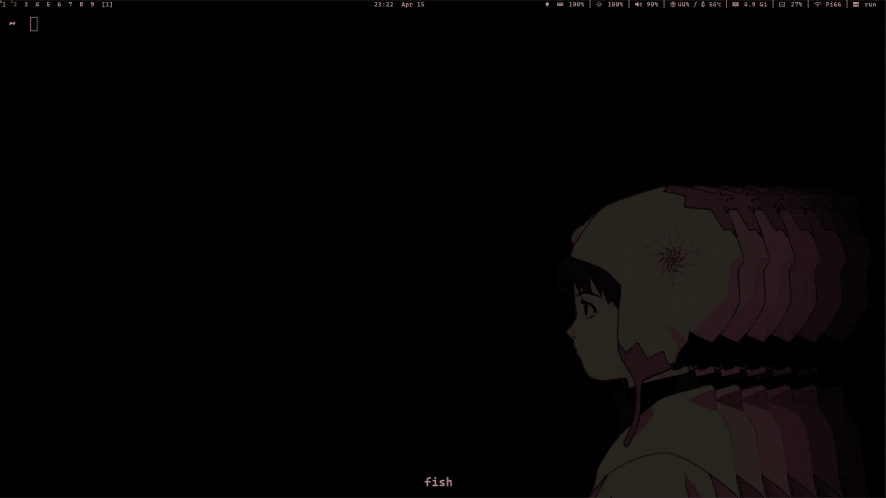
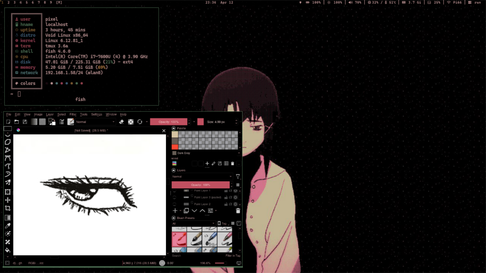
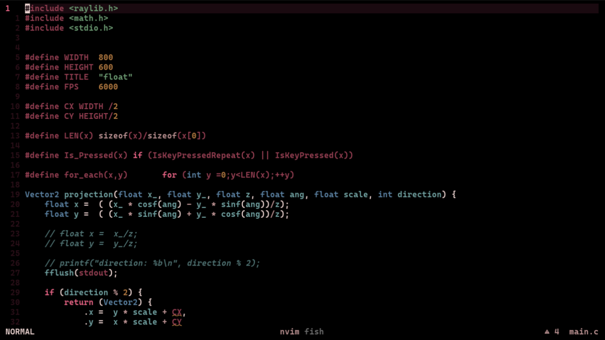
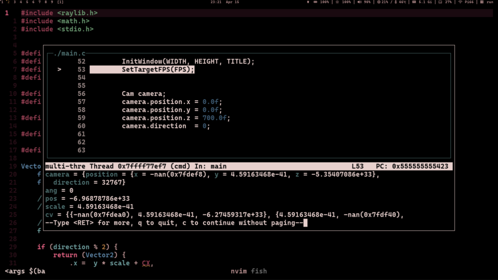

# DWL
dynamic window manager for wayland (dwm for wayland).

> **patches**:
- alwayscenter
- bar
- bar-notitle
- bar-recolr
- customfloat
- gaps
- hide-behind-fullscreen
- hide-behind-monocle
- hide-cursor-when-typing
- pertag
- restore-monitor
- smartborders
- swallow
- tablet-input
- warpcursor
[repo](https://codebergo.org/dwl)

# Neovim
options.lua, globals.lua, commands.lua, binds.lua, are just data files.
Neovim runs init.lua, which loads tables from other files; each table is looped and applied to vim.opt, vim.g, vim.cmd, keymaps, plugins, and LSP setup in order.
Everything is processed by simple for loops calling Neovim APIs.

Plugins setup and LSP are separated modules that run after core config is loaded.

> **Plugins**:
- [Comment.nvim](https://github.com/numToStr/Comment.nvim)
- [cmp-nvim-lsp](https://github.com/hrsh7th/cmp-nvim-lsp)
- [cmp-path](https://github.com/hrsh7th/cmp-path)
- [cord.nvim](https://github.com/vyfor/cord.nvim)
- [gitsigns.nvim](https://github.com/lewis6991/gitsigns.nvim)
- [neo-img](https://github.com/Skardyy/neo-img)
- [nvim-cmp](https://github.com/hrsh7th/nvim-cmp)
- [nvim-colorizer.lua](https://github.com/Pixel2175/nvim-colorizer.lua)
- [nvim-lspconfig](https://github.com/neovim/nvim-lspconfig)
- [nvim-treesitter](https://github.com/nvim-treesitter/nvim-treesitter)
- [toggleterm.nvim](https://github.com/akinsho/toggleterm.nvim)
- [vim-closetag](https://github.com/alvan/vim-closetag)
- [vim-tpipeline](https://github.com/vimpostor/vim-tpipeline)

# Sta
A simple monitoring app inspired by slstatus.
It adds a new feature: it can send an update signal instead of waiting for the delay countdown.
[repo](https://codeberg.org/pi66/sta)

# Colorscheme
I created a custom system-wide colorscheme and apply it to the whole system using a tool called [Walrs](https://codeberg.org/pi66/walrs).
It is used across the window manager, terminal, neovim, and even Krita to keep a consistent look.

## Palette
check `colorscheme` file 

# Preview

<h3 style="text-align: center;">DWL</h3>
<table>
  <tr>
    <td></td>
    <td></td>
  </tr>
</table>

<h3 style="text-align: center;">Neovim</h3>
<table>
  <tr>
    <td></td>
    <td></td>
  </tr>
</table>
